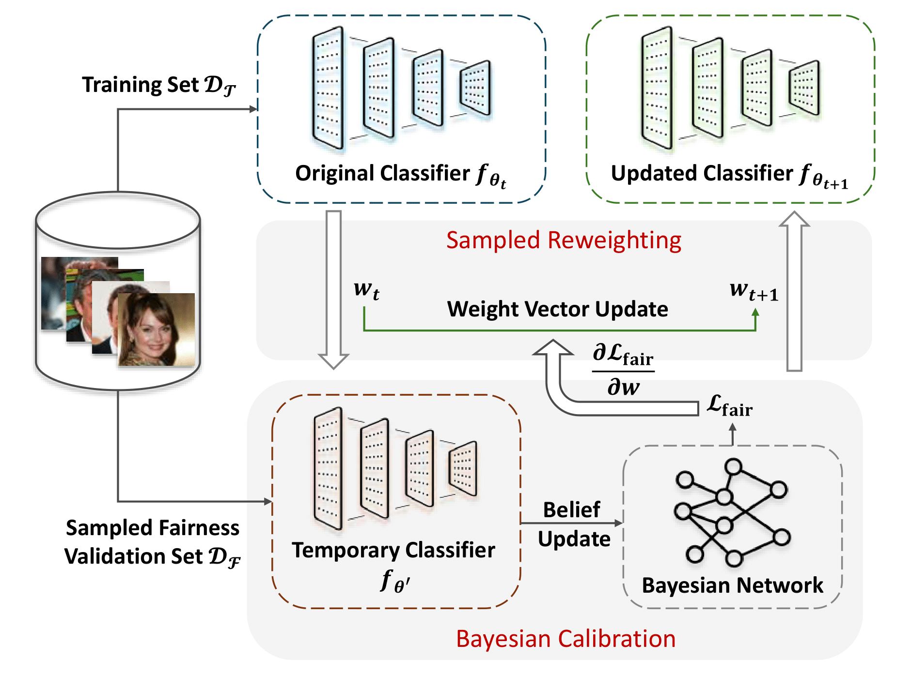

# Component-Based Fairness in Face Attribute Classification with Bayesian Network-informed Meta Learning 
Code implementation for FAccT 2025 paper "Component-Based Fairness in Face Attribute Classification with Bayesian Network-informed Meta Learning"

# Requirement
To prepare the environment, use `./environment.txt` file and conda.

# Training
The training entry is in `./src/train.sh`. In `train.sh`, replace the data_root argument with the path to folder containing CelebA dataset. 

# Visualizations and Models 
Please find the learned Bayesian Network under `BNMR/save/(test)bnn[1, 6, 7, 14, 24].xml`, accompanied with the visualization for 5 attributes and all attributes DAG.

# Acknowledgement

During the implementation we base our code mostly on Transformers from HuggingFace and [Meta-Weight-Net](https://github.com/xjtushujun/meta-weight-net.git) Many thanks to the authors for their great work!

# Cite
Please consider citing the following papers if you use our methods/code in your research:

@inproceedings{liu2025component,
  author       = {Liu, Yifan and Yao, Ruichen and Liu, Yaokun and Zong, Ruohan and Li, Zelin and Zhang, Yang and Wang, Dong},
  title        = {Component-Based Fairness in Face Attribute Classification with Bayesian Network-informed Meta Learning},
  booktitle    = {Proceedings of the 2025 ACM Conference on Fairness, Accountability, and Transparency (FAccT '25)},
  year         = {2025},
  publisher    = {Association for Computing Machinery},
  address      = {Athens, Greece},
  doi          = {10.1145/3715275.3732066},
  isbn         = {979-8-4007-1482-5/2025/06},
  url          = {https://doi.org/10.1145/3715275.3732066}
}
